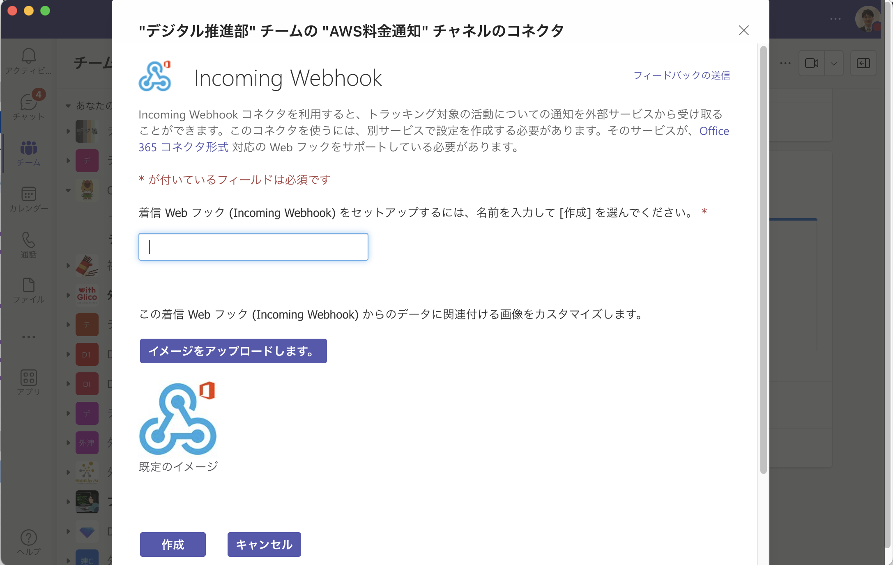

# 実行環境周りについて

## 詳細手順

1. Teams で[incoming-webhook](https://learn.microsoft.com/ja-jp/microsoftteams/platform/webhooks-and-connectors/how-to/add-incoming-webhook?tabs=dotnet)を用意する。

> **Important**
> Incoming Webhook は設定したい teams に入り、コネクタを選択すると以下の画面となる。




2. [AWS CLI](https://docs.aws.amazon.com/ja_jp/cli/latest/userguide/getting-started-install.html) をインストールする。バージョン 1 と バージョン 2 があるので、バージョン 2 の最新版をインストールする。インストール確認方法や初期設定は URL 先を参照。

3. 料金通知 bot を設定したい AWS の AWS コンソールから AWS CLI での操作権限を持つ IAM を発行し、アクセスキーやシークレットキーを控える。これは[README](../README.md)の`実行前の確認`で用いる。


4. terraform 実行環境を準備する。以下の`Docker無しで実行する場合`か`Dockerで実行する場合`を参照する。

5. [README](../README.md)に従って、terraform を実行する。

### Docker 無しで実行する場合

[tfenv](https://github.com/tfutils/tfenv)もしくは[terraform](https://developer.hashicorp.com/terraform/tutorials/aws-get-started/install-cli)をインストールする。インストール確認方法や初期設定は URL 先を参照。tfenv の場合は terraform の仮想環境を作成するところから。

インストール確認は以下のコマンド。

```
terraform --version
```

### Docker で実行する場合

[Docker](https://docs.docker.jp/engine/install/index.html) で Terraform が使える仮想開発環境を作成。
ターミナル（Mac）かコマンドプロンプト（Windows）で以下のコマンドを打つ。

```
docker run -v PATH:DIR -w DIR -it --entrypoint=ash hashicorp/terraform:1.?.?
```

PATH は`docker run`の際にマウントしたいパスを指定（具体例参考）。マウント後のディレクトリは DIR に記載。terraform のバージョンは適宜適切なものを使用。

Docker で terraform が使えるかどうかは`terraform --version`で確認する。

## 参考

terraform を使わない場合の参考：https://zenn.dev/antyuntyun/articles/aws_cost_notification_to_teams_by_lambda

terraform で Lambda 作る：https://zenn.dev/not75743/articles/7a7d3a2fc7e788

terraform の for_each について：https://francescoboffa.com/terraform-multiple-policies-to-roles/

aws cli 及び credentials 周辺：https://zenn.dev/akkie1030/articles/aws-cli-setup-tutorial

docker で aws credentials 周りをマウントする：https://zenn.dev/faycute/articles/e72d62db84084c

terraform の archive_file について：https://registry.terraform.io/providers/hashicorp/archive/latest/docs/data-sources/file

terraform の json をアカウント ID で変化させる：https://stackoverflow.com/questions/48234045/how-do-you-create-an-archive-file-in-terraform

terraform で zip を作るとハッシュ値が変わる対応：https://qiita.com/t0yger/items/ef5baeeacf58ce676747
